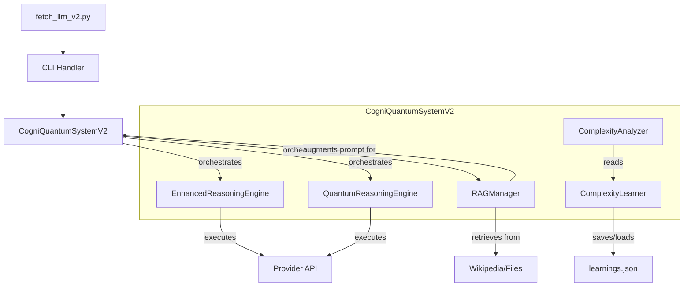

# CogniQuantum: Advanced Reasoning System for Large Language Models

## Breaking Through "The Illusion of Thinking" - A Research-Based Implementation

**CogniQuantum** is a revolutionary LLM interface that implements solutions to overcome the fundamental limitations identified in Apple Research's groundbreaking paper ["The Illusion of Thinking"](https://ml-site.cdn-apple.com/papers/the-illusion-of-thinking.pdf). This updated version introduces powerful new features including Retrieval-Augmented Generation (RAG), quantum-inspired reasoning, and self-improving complexity analysis.

[](https://python.org)
[](LICENSE)
[](https://ml-site.cdn-apple.com/papers/the-illusion-of-thinking.pdf)
[](README.md)


---

## 🚀 **Core Features & Modes**

### **Research-Based Reasoning Modes**

Our system offers a comprehensive suite of reasoning modes designed to tackle problems of any complexity level, now enhanced with advanced strategies.

| Mode | Target Complexity | Primary Benefit | Use Case |
|---|---|---|---|
| `efficient` | Low | **Overthinking Prevention** | Quick questions, basic tasks |
| `balanced` | Medium | Optimal Reasoning Quality | Standard analysis, explanations |
| `decomposed` | High | **Collapse Prevention & Speed** | Complex problem-solving, system design |
| `adaptive` | Auto-detected | **Dynamic Optimization** | Questions of unknown or mixed complexity |
| `parallel` | All | **Best-of-Breed Quality** | Mission-critical tasks, maximum quality |
| `quantum_inspired` | All | Holistic, Synthesized Insight | Brainstorming, philosophical questions, strategy |
| `edge` | Low | Lightweight & Fast | Low-resource devices, quick checks |
| `speculative_thought` | All | Exploratory, Rapid Prototyping | Early-stage ideation, multiple perspectives |
| `paper_optimized` | All | Complete Research Integration | Maximum research benefit, benchmarking |

### **Advanced Features**

- **Automatic Complexity Analysis**: Real-time, multi-language problem complexity assessment
- **Self-Improving Analysis**: Learns from past interactions to make smarter future decisions
- **Dynamic Strategy Selection**: Optimal reasoning approach chosen per problem
- **Retrieval-Augmented Generation (RAG)**: Augments prompts with external knowledge from **Wikipedia** or local files/URLs
- **Overthinking & Collapse Prevention**: Core mechanisms to maintain efficiency and reasoning quality
- **Multi-Provider Support**: OpenAI, Claude, Gemini, Ollama, HuggingFace
- **Structured Thought Process**: Outputs detailed reasoning steps for full transparency

---

## 🛠️ Installation & Quick Start

### **Requirements**
- Python 3.10+
- Install all dependencies: `pip install -r requirements.txt`
- At least one LLM provider API key or a local Ollama setup

### **Setup**
```bash
# Clone the repository
git clone https://github.com/littlebuddha-dev/Cogni-Quantum.git
cd Cogni-Quantum

# Install all required dependencies
pip install -r requirements.txt

# Create and configure your environment file
cp .env.example .env
# Edit .env with your API keys (OPENAI_API_KEY, etc.)

# Test your setup
python quick_test_v2.py
```

### **Immediate Usage**

```bash
# Basic efficiency test
python fetch_llm_v2.py ollama "What is the capital of Japan?" --mode efficient

# Complex reasoning with collapse prevention
python fetch_llm_v2.py claude "Design a sustainable urban transportation system." --mode decomposed

# Adaptive mode for unknown complexity
python fetch_llm_v2.py openai "Analyze the economic impact of AI on the job market." --mode adaptive

# Quantum-inspired synthesis for deep insights
python fetch_llm_v2.py openai "What is the nature of consciousness?" --mode quantum_inspired

# Speculative thought for diverse initial ideas
python fetch_llm_v2.py ollama "Generate three innovative business ideas for a remote work future." --mode speculative_thought

# RAG-powered query using Wikipedia
python fetch_llm_v2.py openai "What were the key findings of the LIGO experiment?" --mode balanced --wikipedia
```

---

## 🎮 Usage Examples

### **Academic Research with RAG**

```bash
# Augment a query with the latest information from Wikipedia
python fetch_llm_v2.py claude \
"Based on recent findings, what are the main challenges in quantum computing?" \
--mode balanced --wikipedia
```

### **Business Strategy Synthesis**

```bash
# Use quantum-inspired mode to generate a multi-faceted strategy
python fetch_llm_v2.py openai \
"Develop a holistic market entry strategy for an AI startup in Europe, considering optimistic, pessimistic, and ethical viewpoints." \
--mode quantum_inspired
```

### **Technical Problem Solving**

```bash
# Design a complex system using the decomposition strategy
python fetch_llm_v2.py ollama \
"Design a high-availability, scalable microservices architecture for a social media app." \
--mode decomposed --model deepseek-r1
```

---

## 🔬 Architecture & Implementation

The V2 architecture integrates new components for RAG, self-learning, and advanced reasoning pipelines.

### **Core Components**



### **Research Implementation Pipeline**

1. **Input**: User prompt is received
2. **RAG (Optional)**: RAGManager extracts a search query, retrieves context from Wikipedia or local files, and augments the prompt
3. **Complexity Analysis**: AdaptiveComplexityAnalyzer assesses the complexity, potentially using suggestions from the ComplexityLearner
4. **Pipeline Selection**: The system chooses a reasoning pipeline (EnhancedReasoningEngine, QuantumReasoningEngine, Parallel) based on the selected mode
5. **Execution**: The chosen engine processes the prompt, applying regime-specific strategies (e.g., decomposition, overthinking prevention)
6. **Self-Correction (Adaptive Mode)**: The system can re-evaluate an insufficient solution and escalate the complexity regime for another attempt
7. **Learning**: If the complexity was adjusted, ComplexityLearner records the successful outcome to improve future analyses
8. **Output**: A final, structured solution with a detailed thought process is returned

---

## 🧪 Testing & Validation

A comprehensive test suite is included to ensure system stability and performance.

```bash
# Quick system health check
python quick_test_v2.py

# Run a comprehensive test across all available V2 providers and modes
python test_all_v2_providers.py
```

---

## 🤝 Supported Providers

| Provider | Standard | Enhanced V2 | Special Features |
|---|---|---|---|
| OpenAI | ✅ | ✅ | GPT-4o optimization, vision support |
| Claude | ✅ | ✅ | Reasoning specialization, large context |
| Gemini | ✅ | ✅ | Multimodal, speed optimization |
| Ollama | ✅ | ✅ | Local models, privacy, cost-free, concurrency-safe |
| HuggingFace | ✅ | ✅ | Open-source diversity, experimentation |

---

## 📚 Developer API

The core logic can be integrated directly into other Python applications.

### **Direct System Usage**

```python
# /main_api_example.py
# Title: API Usage Example
# Role: Demonstrates how to use CogniQuantumSystemV2 directly in Python applications

import asyncio
from llm_api.providers import get_provider
from llm_api.cogniquantum import CogniQuantumSystemV2, ComplexityRegime

async def run():
    # Get an enhanced provider
    provider = get_provider('openai', enhanced=True)
    
    # The provider's enhanced_call uses the CogniQuantumSystemV2 internally
    result = await provider.call(
        "Design a quantum-classical hybrid algorithm for financial modeling.",
        mode='decomposed'  # Use a V2 mode
    )

    if not result.get('error'):
        print("Final Solution:\n", result['text'])
        # Access the structured thought process
        thought_process = result.get('paper_based_improvements', {}).get('thought_process', {})
        print("\nThought Process:\n", thought_process)

if __name__ == "__main__":
    asyncio.run(run())
```

---

## 📜 License

MIT License - see the LICENSE file for details.

This is an independent research implementation based on the publicly available Apple Research paper and is not an official Apple product.